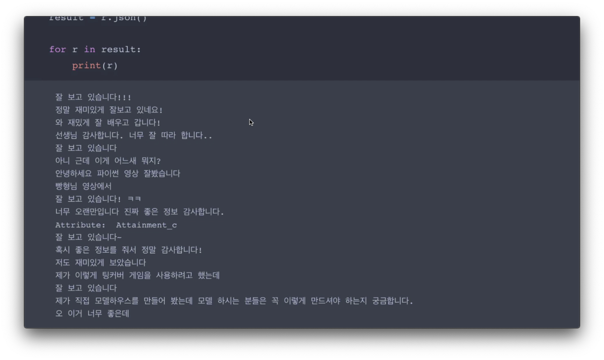

# YouTube Comment Bot

I create YouTube comment bot using KoGPT2.

## Test

- 댓글봇 테스트: https://kubecon-tabtab-ainize-team.endpoint.ainize.ai/?modelUrl=https://train-apgvsf6fu3r69b8eykct-gpt2-train-teachable-ainize.endpoint.ainize.ai/predictions/gpt-2-ko-small-finetune
- 댓글봇 API: https://ainize.ai/teachable-ainize/gpt2-train?branch=train/apgvsf6fu3r69b8eykct

## Dependency

- Python 3
- requests
- python-youtube

## Reference

- Ainize: https://ainize.ai/teachable-nlp
